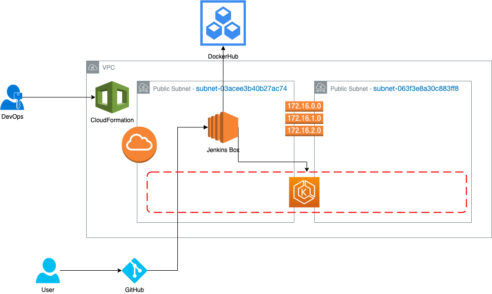
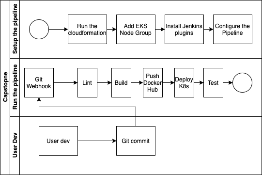
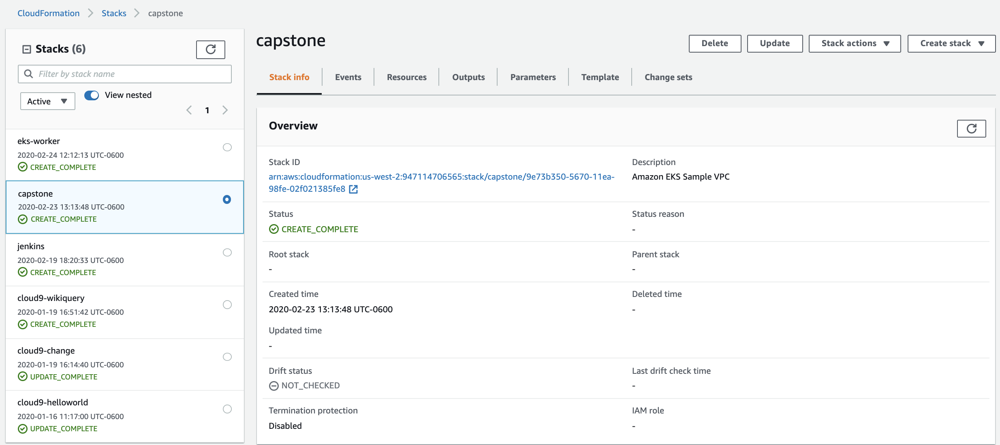
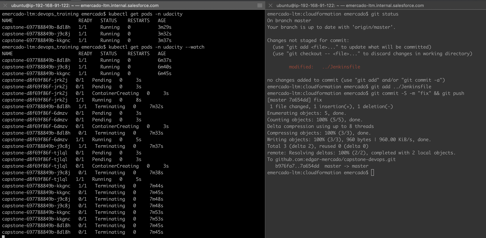
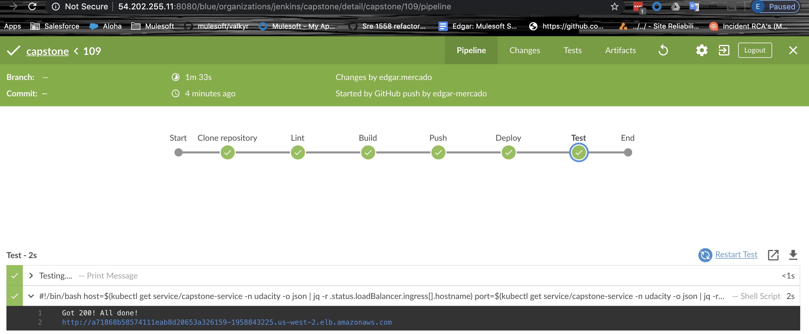

# capstone-devops


# Architecture

## Diagram



## Description

Capstone is a project created to implement the knowladge gained during the DevOps nanodegree course from Udacity, this pipeline used rolling up deployments to update the service. This pipeline is:

Working in AWS
Using Jenkins to implement Continuous Integration and Continuous Deployment
Building pipelines
Working with  CloudFormation to deploy clusters
Building Kubernetes clusters
Building Docker containers in pipelines

## Repositories

* GitHub
* [DockerHub](https://hub.docker.com/repository/docker/ecme820721)

## Tools
* AWS
* CloudFormation
* Jenkins
* Docker
* Kubernetes
* Python
* Bash

## Workflow



## Requirements

1. [AWS account](https://aws.amazon.com/premiumsupport/knowledge-center/create-and-activate-aws-account/)
2. [Docker Hub account](https://hub.docker.com/signup)
3. [GitHub account](https://github.com/join)
4. aws cli
5. jq
6. Linux/OSX
7. kubectl

## Steps to setup the pipeline
1. Fork and clone the repository
```
$ git clone git@github.com:<your-GitHub-user>/capstone-devops.git
$ cd capstone-devops
```
2. Create an IAM user and configure your aws cli
3. Run the script to create the pipeline
```
$ cd cloudformation
$ chmod +x stack-helper.sh
$ ./stack-helper.sh create capstone vpc-jk-eks.yaml params.json
```
`stack-helper.sh` is an script created to simplify the CloudFormation calls
4. Wait for the pipeline to complete the creation

5. [Add an EKS Node Group](https://docs.aws.amazon.com/eks/latest/userguide/create-managed-node-group.html)
6. [Provide access to the EKS cluster](https://aws.amazon.com/premiumsupport/knowledge-center/amazon-eks-cluster-access/)
7. Create a namespaces called udacity
```
$ kubectl create namespace udacity
```
8. Configure Jenkins and install the plugins BlueOcean and AWS
9. [Add the GitHub webhook to Jenkins](https://dzone.com/articles/adding-a-github-webhook-in-your-jenkins-pipeline)
10. Commit a code change in app.py or run the Jenkins job manually to start the rolling up deploy
11. Check how the rolling deploy is being performed

12. Review the Jenkins job logs and test the ULR provided in the logs, the build version in the webpage is updated according to each job execution


