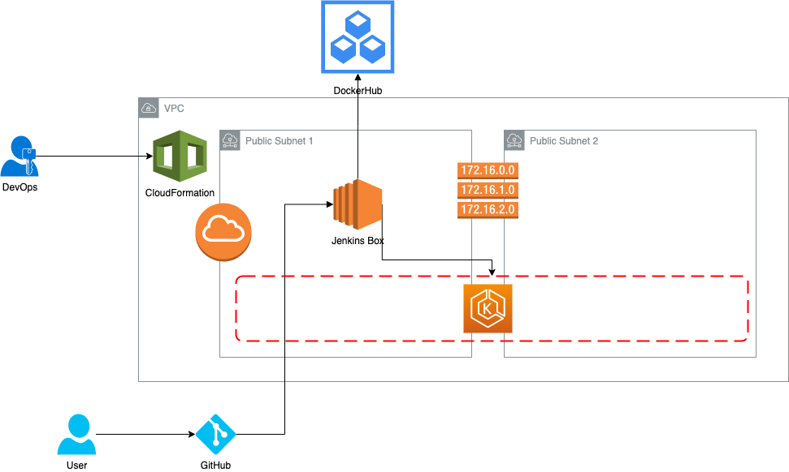

# capstone-devops


# Architecture

## Diagram



## Description

Capstone is a project created to implement the knowladge gained during the DevOps nanodegree course from Udacity. These include:

Working in AWS
Using Jenkins to implement Continuous Integration and Continuous Deployment
Building pipelines
Working with Ansible and CloudFormation to deploy clusters
Building Kubernetes clusters
Building Docker containers in pipelines

## Repositories

* GitHub
* [DockerHub](https://hub.docker.com/repository/docker/ecme820721)

## Tools
* AWS
* CloudFormation
* Jenkins
* Docker
* Kubernetes
* Python
* Bash

## Workflow


## Requirements

1. [AWS account](https://aws.amazon.com/premiumsupport/knowledge-center/create-and-activate-aws-account/)
2. [Docker Hub account](https://hub.docker.com/signup)
3. [GitHub account](https://github.com/join)
4. aws cli
5. jq
6. Linux/OSX
7. kubectl

## Steps to setup the pipeline
1. Clone the repository
```
$ git clone git@github.com:edgar-mercado/capstone-devops.git
$ cd capstone-devops
```
2. Create an IAM user and configure your aws cli
3. Run the script to create the pipeline
```
$ cd cloudformation
$ chmod +x stack-helper.sh
$ ./stack-helper.sh create capstone vpc-jk-eks.yaml params.json
```
4. Wait for the pipeline to complete the creation
5. [Add an EKS Node Group](https://docs.aws.amazon.com/eks/latest/userguide/create-managed-node-group.html)
6. Create a namespaces called udacity
```
$ kubectl create namespace udacity
```
7. Configure Jenkins and install the plugins BlueOcean and AWS
8. [Add the GitHub webhool to Jenkins](https://dzone.com/articles/adding-a-github-webhook-in-your-jenkins-pipeline)
9.
